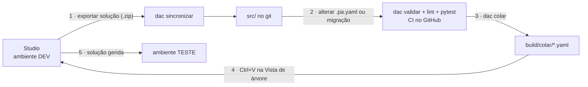

# Ciclo de vida da APP DAC2627 (ALM)

O código em `src/` é a fonte de verdade para ler, rever e alterar. O Power Apps Studio continua a ser o único sítio onde a app corre e é publicada. O ciclo liga os dois.


```mermaid
flowchart LR
  A[Studio<br/>ambiente DEV] -- "1 · exportar solução (.zip)" --> B[dac sincronizar]
  B --> C[src/ no git]
  C -- "2 · alterar .pa.yaml ou migração" --> D[dac validar + lint + pytest<br/>CI no GitHub]
  D -- "3 · dac colar" --> E[build/colar/*.yaml]
  E -- "4 · Ctrl+V na Vista de árvore" --> A
  A -- "5 · solução gerida" --> F[ambiente TESTE]
```

## 1. Do Studio para o git

1. No Studio, **Guardar** e **Publicar**. Publicar é obrigatório: a exportação da solução leva a última versão **publicada** da canvas app, não a guardada. A exportação 1.0.0.2 (16/11/2026) saiu igual, byte a byte, à 1.0.0.1, porque a v1.2.0 estava guardada mas não publicada. Em **Soluções › DAC2627 › DAC2627_RGJCA › Detalhes › Versões**, a versão marcada **Live** é a que vai na exportação e a que os alunos abrem.
2. Em **Soluções › DAC2627 › Exportar**, exportar como **Não gerida** e descarregar o `.zip`.
3. No repositório:

```bash
python -m tools.dac sincronizar ~/Transferências/DAC2627_1_1_0_0.zip
```

```bash
git diff src/
```

```bash
make verificar
```

`sincronizar` substitui `solution/` e `msapp/`, guarda o zip em `_export/` e copia os `.pa.yaml` para `src/`. Os caminhos Windows do `.msapp` (`Src\App.pa.yaml`) são normalizados.

## 2. Alterar o código

- Pequenas alterações: editar o `.pa.yaml` diretamente.
- Alterações repetitivas ou em muitos controlos: escrever uma migração em `tools/migracoes/mNNN_*.py`, idempotente, como a `m001`. Fica documentado o que mudou e porquê, e a alteração pode ser repetida.
- Depois de cada alteração: `make verificar`. O CI (`.github/workflows/verificar.yml`) corre o mesmo em cada push.

## 3 e 4. Do git para o Studio

```bash
python -m tools.dac colar
```

Em `build/colar/` ficam:

| Ficheiro | Onde vai |
|---|---|
| `ORDEM.md` | **O guia a seguir, passo a passo**: fontes de dados, `App.Formulas`, ecrãs pela ordem certa, confirmação e exportação |
| `App.Formulas.pt.txt` | Propriedade **Formulas** do objeto **App**, na **barra de fórmulas** (substituir tudo). Já vem com `;` e `;;` |
| `scrXxx.yaml` | Um ecrã: eliminar o antigo, abrir o ficheiro, copiar tudo e fazer Ctrl+V na **Vista de árvore** |
| `TODOS_OS_ECRAS.yaml` | Todos os ecrãs de uma vez, já pela ordem do `ORDEM.md`. Só para quem já conhece o processo: se um ecrã falhar, é mais difícil perceber qual |

As regras que o `ORDEM.md` aplica, e porquê (aprendidas na colagem de 10/11/2026):

1. **Fontes de dados primeiro.** Os `.yaml` usam os nomes das fontes mas não as trazem: a ligação vive na app, e eliminar ecrãs pode deixá-la sem elas. Sem a tabela **Cloud Service**, só o `scrL2Servicos` deu 101 erros em cascata. As fontes estão em `dac.yaml › fontes`, com as armadilhas de cada uma (há duas tabelas chamadas "Cloud Service").
2. **`App.Formulas` na barra de fórmulas, não na Vista de árvore.** Colado na árvore, o Studio lê o texto como YAML e responde `PA1001 ... YamlInvalidSyntax`.
3. **Eliminar, nunca renomear.** Renomear `scrL1Pedido` para `scrL1Pedido_old` faz o Studio mudar as fórmulas dos outros ecrãs para `scrL1Pedido_old`, e essas ligações partem quando o antigo sai. Com o antigo ainda na app, o novo entra com `_1` em todos os nomes.
4. **Quem envia variáveis antes de quem as recebe.** Uma variável que chega por `Navigate(scrX, ..., {locY: ...})` só é reconhecida se um dos ecrãs que a envia já estiver na app quando `scrX` é colado; o Studio não volta a verificar depois. Basta um: é isso que resolve o ciclo `scrL3Detalhe` ⇄ `scrL3Publicacao`, colando antes o `scrL3Lista`. O `dac colar` calcula a ordem a partir do código (`tools/dac/ordem.py`) e avisa se houver um ciclo sem saída.
5. **Guardar e Publicar no fim.** Nada avisa se não se publicar, e a exportação leva a versão publicada (passo 1). Foi por isso que a exportação de 16/11/2026 não tinha nada das versões coladas depois da última publicação.
6. **Fechar o ciclo:** Verificador de aplicações (avisos esperados abaixo), testes da secção G2 do manual, exportar (passo 1), `dac sincronizar` e `dac deriva` igual a zero. O `git diff src/` só deve mostrar valores por omissão apagados pelo Studio.

Antes de gerar os blocos, `dac colar` compara as fontes usadas no código com as da última exportação (`msapp/References/DataSources.json`): avisa se faltar uma fonte na app ou se uma apontar para outra tabela (`conjunto` em `dac.yaml › fontes`). Com `--estrito`, falha. O lint não vê nada disto: a 10/11/2026 estava a zero e o Studio mostrou 205 erros.

### O que o Studio muda ao guardar

O Studio apaga as propriedades iguais ao valor por omissão. Na exportação 1.0.0.3 foram 116 linhas: 86 × `TabIndex -1`, 15 × `AccessibleLabel ""`, 8 × `DropShadow.Light`, e algumas mais. A app fica igual, mas o código colado deixa de bater certo com o exportado, e o lint passou de 0 para 109 avisos. Por isso:

- `yamlio` não escreve esses valores (tabela `OMISSAO` em `tools/dac/yamlio.py`), e as migrações herdam isso.
- O lint lê uma propriedade ausente como o valor por omissão, e o DAC504 avisa quando o código escreve um.

### Avisos do Verificador que ficam de propósito

O Verificador marca todos os controlos com `TabIndex = -1` que não estejam numa galeria com `OnSelect = Select(Parent)`: 134 avisos «Tabulação em falta» na exportação 1.0.0.3 198 na v1.3.0 e 211 na v1.4.0 (19/11/2026), os de mais todos etiquetas de texto do `scrL4Complemento` (64) e da ficha do serviço da Ficha 02 (13), em etiquetas, ícones de estado, retângulos e nas cinco pílulas. A Microsoft manda pôr `-1` nos elementos não interativos ([Criar apps acessíveis](https://learn.microsoft.com/power-apps/maker/canvas-apps/accessible-apps)). Dar-lhes `TabIndex = 0` limparia o aviso e obrigaria quem usa o teclado a passar por cada texto. Ficam também os avisos de `AccessibleLabel` em retângulos e ícones decorativos: 11 na 1.0.0.3 e 8 na v1.3.0, porque a tabela antiga do complemento, com dois retângulos e uma galeria, saiu. Os 43 avisos de foco invisível nas etiquetas dos formulários foram corrigidos na m003.

O Studio só aceita a colagem com um Ctrl+V real do utilizador.

## 5. Ambientes e solução gerida

| Ambiente | Tipo de solução | Quem altera |
|---|---|---|
| DEV (o ambiente pessoal do aluno ou do docente) | Não gerida | Studio |
| TESTE (opcional, para demonstração) | Gerida | Só por importação |

Os fluxos `.github/workflows/alm-exportar.yml` e `alm-importar.yml` são **modelos** com as Power Platform Actions da Microsoft. Precisam de:

1. Um registo de aplicação no Microsoft Entra ID, com um segredo de cliente.
2. Esse registo como **Utilizador de aplicação** em cada ambiente (centro de administração do Power Platform › Ambiente › Definições › Utilizadores de aplicação), com a função **Administrador de Sistema**.
3. Os segredos `PP_APP_ID`, `PP_CLIENT_SECRET` e `PP_TENANT_ID`, e as variáveis `PP_ENV_DEV` e `PP_ENV_TESTE` no repositório do GitHub.

Não foram executados contra um ambiente real. Antes de os usar, confirme os nomes dos inputs na documentação das Power Platform Actions. Num tenant académico, o registo de aplicação costuma precisar de autorização do administrador de TI.

## Alternativas

- **Pipelines no Power Platform**: implementações entre ambientes sem GitHub, configuradas no próprio portal. Pedem ambientes geridos.
- **Integração Git nativa do Power Platform**: liga a solução diretamente a um repositório (Azure DevOps).
- **`pac` CLI** (`pac solution export`, `pac solution unpack`): o mesmo que os fluxos acima, à mão, a partir do terminal.

Fontes: [Power Platform Actions para GitHub](https://learn.microsoft.com/power-platform/alm/devops-github-actions), [Visão geral de ALM](https://learn.microsoft.com/power-platform/alm/overview-alm), [Código-fonte Power Fx YAML](https://learn.microsoft.com/power-apps/maker/canvas-apps/power-apps-yaml), [schema pa.yaml v3.0](https://github.com/microsoft/PowerApps-Tooling/tree/master/schemas/pa-yaml/v3.0).
